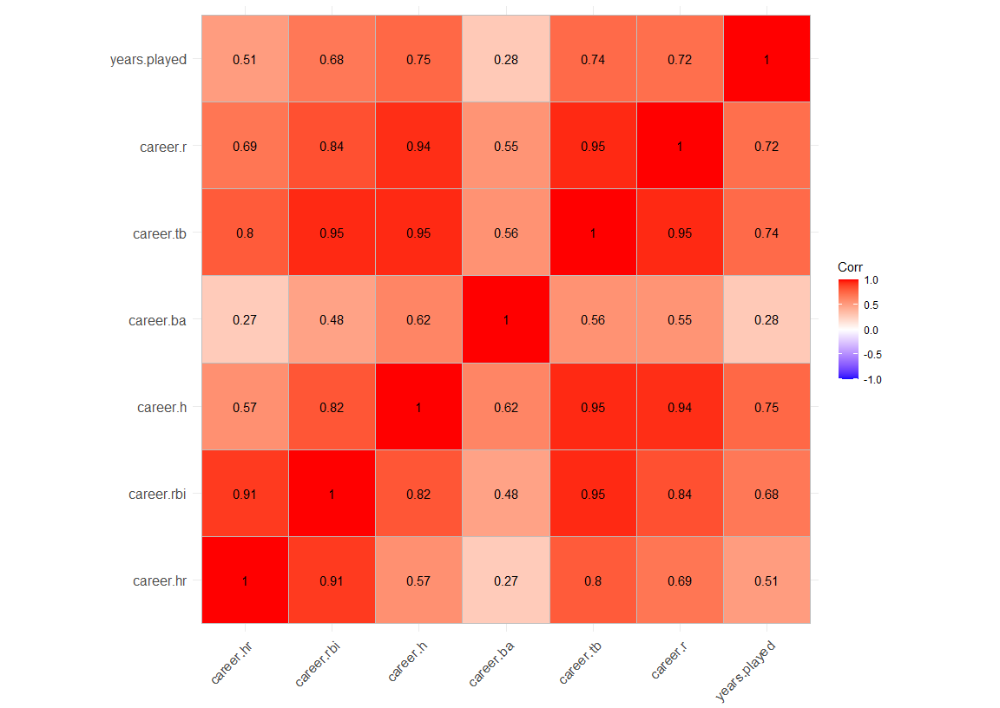

Using Machine Learning Models to Predict MLB Hall of Fame Status
================
Jonathan Eman

## Set-Up

``` r
# Load libraries used for analysis
library(Lahman)
library(tidyverse)
library(MASS)
library(klaR)
library(ICS)
library(ROCR)
library(boot)
library(ipred)
library(car)
library(ggcorrplot)
library(tree) 
library(randomForest) 
library(gbm) 
library(ggpubr)

# Set seed so results are reproducible
set.seed(10282019)
```

# Clean Data

``` r
# store base tables from Lahman package
Fielding <- Lahman::Fielding
Batting <- Lahman::Batting
HallOfFame <- Lahman::HallOfFame

# battingStats(Batting) adds other statistics (batting avg, on base %, etc.)
left_join(Batting, battingStats(Batting)) -> Batting.complete

# create subset of only position players (pitchers excluded from this study)
Fielding %>%
   dplyr::select(playerID, POS, G) %>%
   filter(POS != "P") %>%
   group_by(playerID) %>%
   summarize(total.games = sum(G)) %>%
   distinct(playerID, .keep_all = TRUE) %>%
   filter(total.games > 10) -> Fielding.subset

# calculate career batting statistics
Batting.complete %>%
   group_by(playerID) %>%
   summarize(career.hr = sum(HR),
             career.rbi = sum(RBI),
             career.h = sum(H),
             career.ba = sum(H)/sum(AB),
             career.tb = sum(TB),
             career.r = sum(R),
             years.played = sum(stint == 1)) %>%
   right_join(HallOfFame %>% dplyr::select(-needed_note)) %>%
   filter(category == "Player",
          yearID > 1970,
          votedBy == "BBWAA",
          years.played >= 10) %>%
   distinct(playerID, .keep_all = TRUE) %>% # distinct keeps only info from 1st year player was eligible
   inner_join(Fielding.subset) -> HallOfFame.batting

# remove any players with missing stats
HallOfFame.batting <- na.omit(HallOfFame.batting)
```

# Visualize Data

``` r
#Correlation plot for quantitative variables
HallOfFame.batting[,c(2:8)] %>%
   na.omit() -> HoF.bat.quant

cor(HoF.bat.quant) %>% ggcorrplot::ggcorrplot(lab = TRUE)
```

<!-- -->

``` r
# Exploratory Data Analysis for HoF inductees vs. non-inductees
HallOfFame.batting %>% 
   filter(!is.na(career.ba)) %>%
   ggplot() + geom_boxplot(aes(x=inducted, y=career.ba)) +
   labs(x = "First Ballot Inducted Status", y = "Career Batting Average") +
   ggtitle("Career Batting Average vs. HOF Status") +
   scale_x_discrete(labels=c("N" = "No", "Y" = "Yes")) -> ba

HallOfFame.batting %>% 
   filter(!is.na(career.h)) %>%
   ggplot() + geom_boxplot(aes(x=inducted, y=career.h)) +
   labs(x = "First Ballot Inducted Status", y = "Career Hits") +
   ggtitle("Career Hits vs. HOF Status") +
   scale_x_discrete(labels=c("N" = "No", "Y" = "Yes")) -> h

HallOfFame.batting %>% 
   ggplot() + geom_boxplot(aes(x=inducted, y=years.played)) + 
   labs(x = "First Ballot Inducted Status", y = "Number of Years Played") +
   ggtitle("Career Years Played vs. HOF Status") +
   scale_x_discrete(labels=c("N" = "No", "Y" = "Yes")) -> y

HallOfFame.batting %>% 
   filter(!is.na(career.hr)) %>%
   ggplot() + geom_boxplot(aes(x=inducted, y=career.hr)) + 
   labs(x = "First Ballot Inducted Status", y = "Career Homeruns") +
   ggtitle("Career Homeruns vs. HOF Status") +
   scale_x_discrete(labels=c("N" = "No", "Y" = "Yes")) -> hr

HallOfFame.batting %>% 
   filter(!is.na(career.rbi)) %>%
   ggplot() + geom_boxplot(aes(x=inducted, y=career.rbi)) + 
   labs(x = "First Ballot Inducted Status", y = "Career RBI") +
   ggtitle("Career RBI vs. HOF Status") +
   scale_x_discrete(labels=c("N" = "No", "Y" = "Yes")) -> rbi

HallOfFame.batting %>% 
   filter(!is.na(career.r)) %>%
   ggplot() + geom_boxplot(aes(x=inducted, y=career.r)) + 
   labs(x = "First Ballot Inducted Status", y = "Career Runs") +
   ggtitle("Career Runs vs. HOF Status") +
   scale_x_discrete(labels=c("N" = "No", "Y" = "Yes")) -> r

HallOfFame.batting %>% 
   filter(!is.na(career.tb)) %>%
   ggplot() + geom_boxplot(aes(x=inducted, y=career.tb)) + 
   labs(x = "First Ballot Inducted Status", y = "Career Total Bases") +
   ggtitle("Career Total Bases vs. HOF Status") +
   scale_x_discrete(labels=c("N" = "No", "Y" = "Yes")) -> tb

ggarrange(ba, h, y, hr, rbi, r, tb, ncol = 3, nrow = 3)
```

<!-- -->

# Modeling Phase 1: Logistic Regression and Linear Discriminant Analysis

## Fit initial models

``` r
# check dummy coding of response, N=0, Y=1
contrasts(HallOfFame.batting$inducted)
```

    ##   Y
    ## N 0
    ## Y 1

``` r
# evenly split data into train and test sets
sample.data<-sample.int(nrow(HallOfFame.batting), floor(.50*nrow(HallOfFame.batting)), replace = F)
train<-HallOfFame.batting[sample.data, ]
test<-HallOfFame.batting[-sample.data, ]

# fit logistic regression using training data
logistic_train<-glm(inducted ~ career.ba + career.h + career.hr + career.r + career.rbi + career.tb + years.played, family=binomial, data=train)

# assess VIF and model fit
vif(logistic_train)
```

    ##    career.ba     career.h    career.hr     career.r   career.rbi    career.tb 
    ##     1.843375    65.641627    57.595020     5.860904    15.585880   130.923335 
    ## years.played 
    ##     2.173150

``` r
summary(logistic_train)
```

    ## 
    ## Call:
    ## glm(formula = inducted ~ career.ba + career.h + career.hr + career.r + 
    ##     career.rbi + career.tb + years.played, family = binomial, 
    ##     data = train)
    ## 
    ## Deviance Residuals: 
    ##      Min        1Q    Median        3Q       Max  
    ## -1.90095  -0.21765  -0.06401  -0.02256   2.54724  
    ## 
    ## Coefficients:
    ##                Estimate Std. Error z value Pr(>|z|)  
    ## (Intercept)  -1.756e+01  7.706e+00  -2.279   0.0227 *
    ## career.ba     1.149e+01  2.558e+01   0.449   0.6534  
    ## career.h      8.847e-03  6.915e-03   1.279   0.2007  
    ## career.hr     1.231e-02  1.550e-02   0.794   0.4271  
    ## career.r      5.632e-04  2.762e-03   0.204   0.8384  
    ## career.rbi    1.665e-03  4.349e-03   0.383   0.7019  
    ## career.tb    -4.251e-03  5.643e-03  -0.753   0.4513  
    ## years.played  5.647e-02  1.900e-01   0.297   0.7663  
    ## ---
    ## Signif. codes:  0 '***' 0.001 '**' 0.01 '*' 0.05 '.' 0.1 ' ' 1
    ## 
    ## (Dispersion parameter for binomial family taken to be 1)
    ## 
    ##     Null deviance: 146.285  on 235  degrees of freedom
    ## Residual deviance:  67.735  on 228  degrees of freedom
    ## AIC: 83.735
    ## 
    ## Number of Fisher Scoring iterations: 8

``` r
# remove TB and re-fit model until max VIF is approximately 5 to reduce multicollinearity
logistic_train<-glm(inducted ~ career.ba + career.h + career.hr + career.r + career.rbi + years.played, family=binomial, data=train)

vif(logistic_train)
```

    ##    career.ba     career.h    career.hr     career.r   career.rbi years.played 
    ##     1.788813     6.511745    14.447818     4.867183    12.915857     1.979667

``` r
logistic_train<-glm(inducted ~ career.ba + career.h + career.r + career.rbi + years.played, family=binomial, data=train)

vif(logistic_train)
```

    ##    career.ba     career.h     career.r   career.rbi years.played 
    ##     1.726869     3.328631     2.514326     1.091091     1.855565

``` r
# fit LDA using training data and same subset of variables
lda_train <- lda(inducted ~ career.ba + career.h  + career.r + career.rbi + years.played, data=train)
```

## Make predictions and compare performance

``` r
par(mfrow=c(1,2)) 

##predicted logistic model values for test data
preds_logistic<-predict(logistic_train, newdata=test, type="response")

##produce the numbers associated with logistic classification table
rates_logistic<-prediction(preds_logistic, test$inducted)

##store the true positive and false postive rates for logistic
roc_result_logistic<-performance(rates_logistic,measure="tpr", x.measure="fpr")

##plot logistic ROC curve and overlay the diagonal line for random guessing
plot(roc_result_logistic, main="ROC Curve for Logistic Reg.")
lines(x = c(0,1), y = c(0,1), col="red")

##predicted LDA model values for test data based on training data
lda_test <- predict(lda_train,test)

##produce the numbers associated with LDA classification table
preds_LDA<-lda_test$posterior[,2] 
rates_LDA<-prediction(preds_LDA, test$inducted)

##store the true positive and false postive rates for LDA
roc_result_LDA<-performance(rates_LDA,measure="tpr", x.measure="fpr")

##plot LDA ROC curve and overlay the diagonal line for random guessing
plot(roc_result_LDA, main="ROC Curve for LDA")
lines(x = c(0,1), y = c(0,1), col="red")
```

<!-- -->

An ROC curve shows a model’s trade off between the false positive rate
and true positive rate. The red line represents a model that makes
predictions as effective as randomly assigning a predicted class to each
observation. Both of these models perform significantly better than a
random guesser.

``` r
##compute the AUC for logistic
auc_logistic<-performance(rates_logistic, measure = "auc")
c("Logistic", auc_logistic@y.values)
```

    ## [[1]]
    ## [1] "Logistic"
    ## 
    ## [[2]]
    ## [1] 0.9738938

``` r
##compute the AUC for LDA
auc_LDA<-performance(rates_LDA, measure = "auc")
c("LDA", auc_LDA@y.values)
```

    ## [[1]]
    ## [1] "LDA"
    ## 
    ## [[2]]
    ## [1] 0.9756637

AUC is another performance metric that quantifies the results from an
ROC curve. A random guesser produces an AUC of 0.5, while a perfect AUC
is 1. Both of these models have extremely high AUCs, with the LDA model
performing slightly better.

## Test model with categorical variable

``` r
# create binary variable
HallOfFame.batting %>%
  mutate(MoreThan16Years = ifelse(years.played > 16,"Y","N") %>% factor()) ->
  HallOfFame.batting

# verify that R is treating new variable correctly, with Y=1
contrasts(HallOfFame.batting$MoreThan16Years)
```

    ##   Y
    ## N 0
    ## Y 1

Despite the models having strong overall performance, it can be seen
that many variables have extremely high p-values and thus are not
contributing to the model predictions. Therefore, we decided to convert
years.played to a categorical variable depending on whether they played
more years than the average of players in our data, which is 16.

Since LDA can only handle numerical variables, only the logistic
regression model will be re-fit with the categorical variable.

``` r
## re-generate train/test
set.seed(10282019)

sample.data<-sample.int(nrow(HallOfFame.batting), floor(.50*nrow(HallOfFame.batting)), replace = F)
train<-HallOfFame.batting[sample.data, ]
test<-HallOfFame.batting[-sample.data, ]

##fit logistic regression using training data
logistic_train_cat<-glm(inducted ~ career.ba + career.h + career.r + career.rbi + MoreThan16Years, family=binomial, data=train)
```

``` r
##predicted logistic model values for test data
preds_logistic_cat<-predict(logistic_train_cat, newdata=test, type="response")

##produce the numbers associated with logistic classification table
rates_logistic_cat<-prediction(preds_logistic_cat, test$inducted)

##store the true positive and false postive rates for logistic
roc_result_logistic_cat<-performance(rates_logistic_cat,measure="tpr", x.measure="fpr")

##plot logistic ROC curve and overlay the diagonal line for random guessing
plot(roc_result_logistic_cat, main="ROC Curve for Logistic Regression")
lines(x = c(0,1), y = c(0,1), col="red")
```

<!-- -->

``` r
##compute the AUC for logistic
auc_logistic_cat<-performance(rates_logistic_cat, measure = "auc")
auc_logistic_cat@y.values
```

    ## [[1]]
    ## [1] 0.9747788

This new model results in a small increase to the AUC.

# Modeling Phase 2: Decision Trees

## Recursive Binary Splitting

``` r
# store actual inducted values from test data
pred.test<-test[,"inducted"]

tree.class.train<-tree(inducted~career.hr+career.rbi+career.h+career.ba+career.tb+career.r+years.played, data=train)

summary(tree.class.train)
```

    ## 
    ## Classification tree:
    ## tree(formula = inducted ~ career.hr + career.rbi + career.h + 
    ##     career.ba + career.tb + career.r + years.played, data = train)
    ## Variables actually used in tree construction:
    ## [1] "career.tb"    "career.r"     "career.hr"    "career.h"     "years.played"
    ## [6] "career.ba"   
    ## Number of terminal nodes:  9 
    ## Residual mean deviance:  0.152 = 34.51 / 227 
    ## Misclassification error rate: 0.0339 = 8 / 236

``` r
plot(tree.class.train)
text(tree.class.train, cex=0.75, pretty=0)
```

<!-- -->

``` r
##find predicted classes for test data
tree.pred.test<-predict(tree.class.train, newdata=test, type="class") %>%
   as.data.frame()

# ##confusion matrix for test data
##actual classes in rows, predicted classes in columns

test %>%
   mutate(accurate = tree.pred.test==pred.test) %>%
   group_by(inducted, accurate) %>%
   summarize(count = n()) -> confusion.data

matrix(c(
   confusion.data[2,3],
   confusion.data[1,3],
   confusion.data[3,3],
   confusion.data[4,3]),
   nrow = 2, byrow = TRUE) -> confusion.matrix.rbs

colnames(confusion.matrix.rbs) <- c("No-Pred.", "Yes-Pred.")
rownames(confusion.matrix.rbs) <- c("No", "Yes")

confusion.matrix.rbs
```

    ##     No-Pred. Yes-Pred.
    ## No  217      9        
    ## Yes 2        8

``` r
##overall error rate
1-mean(tree.pred.test==pred.test)
```

    ## [1] 0.04661017

## Pruning

``` r
### Pruning
cv.class <- cv.tree(tree.class.train, K=10, FUN=prune.misclass)
cv.class
```

    ## $size
    ## [1] 9 5 3 1
    ## 
    ## $dev
    ## [1] 13 13 14 22
    ## 
    ## $k
    ## [1] -Inf  0.0  1.5  5.5
    ## 
    ## $method
    ## [1] "misclass"
    ## 
    ## attr(,"class")
    ## [1] "prune"         "tree.sequence"

``` r
##plot of dev against size
plot(cv.class$size, cv.class$dev,type='b')
```

<!-- -->

``` r
##size of tree chosen by pruning
trees.num.class<-cv.class$size[which.min(cv.class$dev)]
trees.num.class 
```

    ## [1] 9

``` r
##fit tree with size chosen by pruning
prune.class <- prune.misclass(tree.class.train, best=trees.num.class)

##plot pruned tree
plot(prune.class)
text(prune.class, cex=0.75, pretty=0)
```

<!-- -->

``` r
##prediction based on pruned tree for test data
tree.pred.prune <- predict(prune.class, newdata=test, type="class") %>%
   as.data.frame()

test %>%
   mutate(accurate = tree.pred.prune==pred.test) %>%
   group_by(inducted, accurate) %>%
   summarize(count = n()) -> confusion.data

matrix(c(
   confusion.data[2,3],
   confusion.data[1,3],
   confusion.data[3,3],
   confusion.data[4,3]),
   nrow = 2, byrow = TRUE) -> confusion.matrix.prune

colnames(confusion.matrix.prune) <- c("No-Pred.", "Yes-Pred.")
rownames(confusion.matrix.prune) <- c("No", "Yes")

confusion.matrix.prune
```

    ##     No-Pred. Yes-Pred.
    ## No  217      9        
    ## Yes 2        8

``` r
##overall overall error rate
1-mean(tree.pred.prune == pred.test) 
```

    ## [1] 0.04661017

## Bagging

``` r
# fit model
bag.class<-randomForest(inducted~career.hr+career.rbi+career.h+career.ba+career.tb+career.r+years.played, data=train, mtry=7, importance=TRUE)
bag.class ##note with classification tree OOB estimates are provided
```

    ## 
    ## Call:
    ##  randomForest(formula = inducted ~ career.hr + career.rbi + career.h +      career.ba + career.tb + career.r + years.played, data = train,      mtry = 7, importance = TRUE) 
    ##                Type of random forest: classification
    ##                      Number of trees: 500
    ## No. of variables tried at each split: 7
    ## 
    ##         OOB estimate of  error rate: 7.2%
    ## Confusion matrix:
    ##     N  Y class.error
    ## N 208  6  0.02803738
    ## Y  11 11  0.50000000

``` r
##importance measures of predictors
importance(bag.class)
```

    ##                      N          Y MeanDecreaseAccuracy MeanDecreaseGini
    ## career.hr     9.904366  6.5290667            10.989894         3.825649
    ## career.rbi   13.365772 -0.4739332            12.646701         2.224267
    ## career.h     20.855406 12.5457861            23.728127        13.610623
    ## career.ba    13.016532  7.5976359            13.376410         4.063343
    ## career.tb     8.726222  5.5127557            11.147674         7.490085
    ## career.r     11.863671  4.6200373            13.196745         6.392800
    ## years.played -6.303690 11.5154774             5.059176         2.380927

``` r
##graphical version
varImpPlot(bag.class)
```

<!-- -->

``` r
##test error rate with bagging
pred.bag<-predict(bag.class, newdata=test) %>% as.data.frame()

test %>%
   mutate(accurate = pred.bag==pred.test) %>%
   group_by(inducted, accurate) %>%
   summarize(count = n()) -> confusion.data

matrix(c(
   confusion.data[2,3],
   confusion.data[1,3],
   confusion.data[3,3],
   confusion.data[4,3]),
   nrow = 2, byrow = TRUE) -> confusion.matrix.bag

colnames(confusion.matrix.bag) <- c("No-Pred.", "Yes-Pred.")
rownames(confusion.matrix.bag) <- c("No", "Yes")

confusion.matrix.bag
```

    ##     No-Pred. Yes-Pred.
    ## No  220      6        
    ## Yes 5        5

``` r
1-mean(pred.bag==pred.test) 
```

    ## [1] 0.04661017

## Random Forests

``` r
## Random Forests
rf.class<-randomForest(inducted~career.hr+career.rbi+career.h+career.ba+career.tb+career.r+years.played, data=train, mtry=3,importance=TRUE)
rf.class
```

    ## 
    ## Call:
    ##  randomForest(formula = inducted ~ career.hr + career.rbi + career.h +      career.ba + career.tb + career.r + years.played, data = train,      mtry = 3, importance = TRUE) 
    ##                Type of random forest: classification
    ##                      Number of trees: 500
    ## No. of variables tried at each split: 3
    ## 
    ##         OOB estimate of  error rate: 6.36%
    ## Confusion matrix:
    ##     N  Y class.error
    ## N 209  5  0.02336449
    ## Y  10 12  0.45454545

``` r
importance(rf.class)
```

    ##                       N         Y MeanDecreaseAccuracy MeanDecreaseGini
    ## career.hr     8.0122382  4.575171             8.969540         3.579377
    ## career.rbi   10.9902872  3.775984            11.391564         3.440190
    ## career.h     16.0991758 12.301200            18.953232        10.294808
    ## career.ba    12.3671477  7.571699            14.466314         4.013151
    ## career.tb    10.0554721  8.406289            13.815260         8.625307
    ## career.r      9.8867077  4.380225            11.675635         7.077556
    ## years.played -0.8914494 10.401482             7.996984         2.740324

``` r
varImpPlot(rf.class)
```

<!-- -->

``` r
summary(rf.class)
```

    ##                 Length Class  Mode     
    ## call               5   -none- call     
    ## type               1   -none- character
    ## predicted        236   factor numeric  
    ## err.rate        1500   -none- numeric  
    ## confusion          6   -none- numeric  
    ## votes            472   matrix numeric  
    ## oob.times        236   -none- numeric  
    ## classes            2   -none- character
    ## importance        28   -none- numeric  
    ## importanceSD      21   -none- numeric  
    ## localImportance    0   -none- NULL     
    ## proximity          0   -none- NULL     
    ## ntree              1   -none- numeric  
    ## mtry               1   -none- numeric  
    ## forest            14   -none- list     
    ## y                236   factor numeric  
    ## test               0   -none- NULL     
    ## inbag              0   -none- NULL     
    ## terms              3   terms  call

``` r
##test error rate with Random Forest
pred.rf<-predict(rf.class, newdata=test) %>% as.data.frame()

test %>%
   mutate(accurate = pred.rf == pred.test) %>%
   group_by(inducted, accurate) %>%
   summarize(count = n()) -> confusion.data

matrix(c(
   confusion.data[2,3],
   confusion.data[1,3],
   confusion.data[3,3],
   confusion.data[4,3]),
   nrow = 2, byrow = TRUE) -> confusion.matrix.rf

colnames(confusion.matrix.rf) <- c("No-Pred.", "Yes-Pred.")
rownames(confusion.matrix.rf) <- c("No", "Yes")

confusion.matrix.rf
```

    ##     No-Pred. Yes-Pred.
    ## No  220      6        
    ## Yes 3        7

``` r
1-mean(pred.rf==pred.test)
```

    ## [1] 0.03813559

See the slide deck included in this repository for an analysis of our
results and conclusions.
